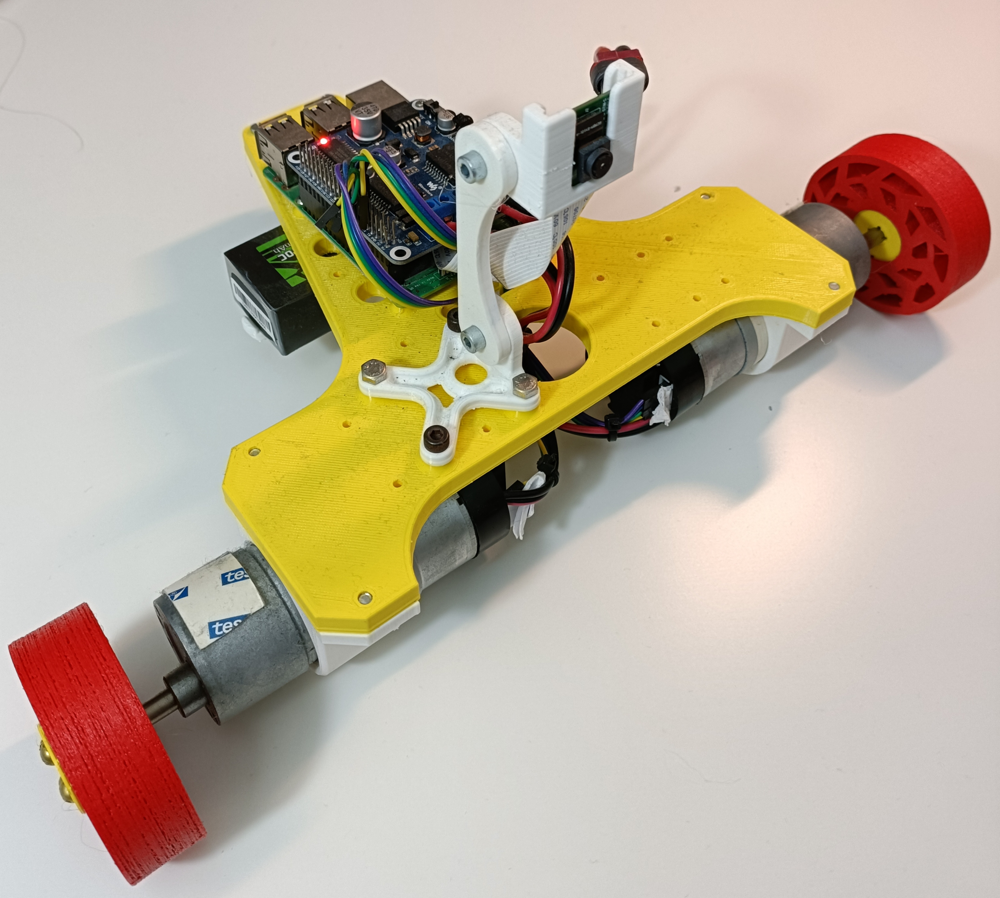
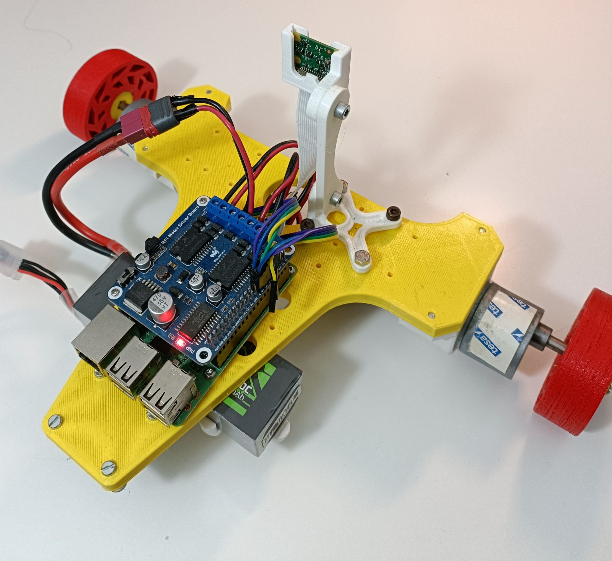

# 3D printed AMR

This project is a 3D printed wheeled robot controled using Python code runnign in a Raspberry PI.

## repository content:

- BOM: CAD and list of materials to build the robot.
- Code: Python code; run main.py

